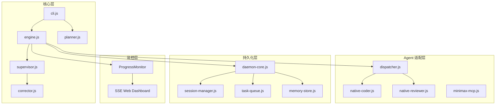

# appMaker

> AI 驱动的 APP 全自动开发系统 — 从「一句话需求」到「可交付代码」，零人工干预。

[](https://bun.sh)
[](https://developer.mozilla.org/en-US/docs/Web/JavaScript/Guide/Modules)
[](./LICENSE)

---

## 核心能力

**appMaker** 是一个基于 Multi-Agent 协作的智能化开发框架，让 AI 自主完成从需求分析到代码交付的全流程：

| 阶段 | Agent | 职责 |
|------|-------|------|
| 规划 | **Planner** | 需求理解、任务分解、里程碑生成 |
| 编程 | **NativeCoder** | 调用 AI 大模型生成代码 |
| 评审 | **NativeReviewer** | 代码质量评估、问题定位 |
| 监控 | **Supervisor** | 进度追踪、风险熔断、Token 预警 |
| 修正 | **Corrector** | 根因分析、自动修复 |

```
用户输入："创建一个博客系统，支持文章发布和评论"
           │
           ▼
    ┌─────────────┐
    │   Planner   │ ← MiniMax MCP 驱动
    └─────────────┘
           │
           ▼ (JSON 计划文件)
    ┌─────────────┐
    │   Engine    │ ← 循环执行任务
    │  ─────────  │
    │  coding →   │ ← NativeCoder 生成代码
    │  review →   │ ← NativeReviewer 评审
    │  fix (if    │ ← Corrector 自动修正
    │      fail)  │
    └─────────────┘
           │
           ▼
       交付产物
```

---

## 环境要求

| 依赖 | 版本 | 说明 |
|------|------|------|
| **Bun** | ≥ 1.0.0 | 运行时环境（替代 Node.js） |
| **API Key** | — | MiniMax / OpenAI / Deepseek 三选一 |

### 安装 Bun

```bash
# Windows (PowerShell)
powershell -c "irm bun.sh/install.ps1 | iex"

# macOS / Linux
curl -fsSL https://bun.sh/install | bash
```

---

## 快速开始

### 1. 安装与配置

```bash
# 克隆项目
git clone <repo-url> && cd appmaker

# 安装依赖（Bun 自动读取 .env）
bun install

# 配置 API Key
cp .env.example .env
```

`.env` 配置示例：

```ini
# MiniMax（推荐用于规划）
MINIMAX_API_KEY=your_key_here
MINIMAX_API_MODEL=MiniMax-Text-01
MINIMAX_API_HOST=https://api.minimaxi.com

# 或使用 OpenAI
OPENAI_API_KEY=your_key_here
OPENAI_MODEL=gpt-4
OPENAI_API_BASE=https://api.openai.com/v1
```

### 2. 一键执行

```bash
# 推荐方式：全自动（生成计划 → 执行 → 评审 → 修正）
bun cli.js run "做一个博客系统，支持文章发布和评论"

# 跳过确认直接执行
bun cli.js run "做一个 TODO 应用" --yes

# 指定工作目录
bun cli.js run "做一个博客系统" --dir ./my-project
```

### 3. 分步操作（可选）

```bash
# 步骤1：生成计划
bun cli.js plan "做一个博客系统"

# 步骤2：执行计划
bun cli.js execute plans/plan_<timestamp>.json

# 步骤3：检查 Agent 状态
bun cli.js health
```

---

## CLI 命令参考

| 命令 | 说明 | 示例 |
|------|------|------|
| `bun cli.js run "<需求>"` | 全自动生成并执行 | `bun cli.js run "做一个博客"` |
| `bun cli.js plan "<需求>"` | 仅生成计划文件 | `bun cli.js plan "做一个 CMS"` |
| `bun cli.js execute <plan.json>` | 执行已有计划 | `bun cli.js execute plans/xxx.json` |
| `bun cli.js health` | 检查 Agent 可用性 | `bun cli.js health` |

### 全局选项

| 选项 | 说明 |
|------|------|
| `--dir <path>` | 指定工作目录（默认 `cwd`） |
| `--no-daemon` | 禁用持久守护进程 |
| `--yes` / `-y` | 跳过确认提示 |
| `DEBUG=1` | 输出完整错误堆栈 |

---

## 架构设计

### 模块关系图



### 目录结构

```
appMaker/
├── cli.js                     # CLI 入口
├── daemon.js                  # 独立守护进程入口
├── src/
│   ├── engine.js              # 执行引擎（编程↔评审循环）
│   ├── planner.js             # 规划器（需求→执行计划）
│   ├── supervisor.js          # 监督者（进度+风险评估）
│   ├── corrector.js           # 修正器（根因分析+自修复）
│   ├── logger.js              # 日志系统
│   │
│   ├── agents/                # Agent 适配层
│   │   ├── index.js           # 统一导出（工厂函数）
│   │   ├── base.js            # AgentAdapter 基类
│   │   ├── dispatcher.js      # 任务调度器（路由+并发控制）
│   │   ├── native-coder.js     # 原生 API 编程适配器
│   │   ├── native-reviewer.js # 原生 API 评审适配器
│   │   └── minimax-mcp.js     # MiniMax MCP 规划适配器
│   │
│   ├── daemon/                # 持久化守护进程
│   │   ├── index.js           # 守护进程主入口
│   │   ├── daemon-core.js     # 核心调度逻辑
│   │   ├── session-manager.js # 会话管理
│   │   ├── task-queue.js      # 任务队列
│   │   └── memory-store.js    # 内存存储
│   │
│   └── monitor/               # 进度监控服务
│       ├── index.js           # Bun.serve + SSE 推送
│       └── public/
│           └── index.html     # Web 仪表盘
│
├── config/                     # 配置系统
│   ├── index.js               # 配置加载器（ESM）
│   ├── schema.js              # Schema 验证
│   ├── defaults.json          # 默认配置
│   └── agents.json            # Agent 配置
│
├── rules/                      # AI 行为约束
│   ├── architecture.rules.md    # 架构分层约束
│   ├── quality.rules.md        # 代码质量规范
│   └── self-correction.rules.md # 修正流程
│
├── skills/                     # 技能定义
│   ├── planning.skill.md       # 需求拆解流程
│   ├── execution.skill.md      # 任务执行协议
│   ├── supervision.skill.md    # 进度监控协议
│   └── agent-call.skill.md     # 外部 Agent 调用
│
└── tests/                      # 单元测试（bun test）
```

---

## API 使用（ESM）

### 方式一：命令行（推荐）

```bash
bun cli.js run "做一个博客系统"
```

### 方式二：JavaScript API

```javascript
import {
  createEngine,
  createPlanner,
  createDispatcher,
  healthCheck,
  dispatch,
  dispatchParallel
} from './src/agents/index.js';

// 健康检查
const status = await healthCheck();
console.log(status);
// { 'native-coder': true, 'native-reviewer': true }

// 生成执行计划
const planner = createPlanner({ project_root: './my-app' });
const plan = await planner.plan('做一个博客系统，支持文章发布和评论');
console.log(plan.milestones);

// 执行计划
const engine = createEngine({ project_root: './my-app', max_review_cycles: 3 });
engine.on('task:done', ({ task, result }) => {
  console.log(`Task ${task.id} completed:`, result.status);
});
const result = await engine.execute(plan);

// 单任务调度
const r = await dispatch({
  type: 'create',
  description: '创建用户认证模块'
});

// 并行任务调度
const results = await dispatchParallel([
  { type: 'create', description: '创建文章模块' },
  { type: 'create', description: '创建评论模块' }
]);
```

---

## 进度监控面板

执行 `run` 或 `execute` 命令时，系统自动启动 Web 仪表盘：

| 项目 | 说明 |
|------|------|
| **地址** | `http://localhost:8088`（端口冲突自动递增） |
| **协议** | Server-Sent Events (SSE)，实时推送 |
| **技术栈** | `Bun.serve`（零依赖） |

---

## 自动修正机制

| 错误类型 | 严重度 | 处理策略 |
|----------|--------|----------|
| 安全漏洞 / 架构违规 | 🔴 严重 | 立即停止，标记人工介入 |
| Token 超限 / 资源耗尽 | 🔴 严重 | 停止接受新任务 |
| 网络超时 / 临时故障 | 🟡 一般 | 自动重试（最多 3 次） |
| 代码质量 / 逻辑 Bug | ⚪ 普通 | Agent 自我修正（最多 3 轮） |

评审 FAIL 时，系统最多进行 `max_review_cycles` 次修正循环，超限则转人工。

---

## 技术栈

| 层级 | 技术选型 | 说明 |
|------|----------|------|
| **运行时** | Bun 1.x | 替代 Node.js，冷启动速度提升 ~10x |
| **模块** | ES Modules (`import/export`) | 现代化模块系统 |
| **HTTP 服务** | `Bun.serve` | 零依赖 Web 服务 |
| **HTTP 客户端** | 原生 `fetch` + `AbortSignal` | 标准 Web API |
| **Agent 通信** | JSON-RPC 2.0 over stdio | 进程间通信 |
| **MCP 协议** | `@modelcontextprotocol/sdk` | 模型上下文协议 |
| **测试** | `bun test` | 内置零配置测试框架 |

---

## 配置参考

### `config/agents.json`

```json
{
  "planner_agent": "minimax-mcp",
  "agents": {
    "minimax-mcp": {
      "enabled": true,
      "description": "搜商 Agent - 负责调研和规划"
    },
    "native-coder": {
      "enabled": true,
      "description": "编程 Agent - 调用大模型完成代码编写",
      "model": "MiniMax-M2.7"
    },
    "native-reviewer": {
      "enabled": true,
      "description": "评审 Agent - 调用大模型完成代码审查",
      "model": "MiniMax-M2.7"
    }
  },
  "dispatcher": {
    "max_concurrent_agents": 3,
    "default_agent": "native-coder"
  }
}
```

---

## 更新日志

### v2.0.0 — 2026-03-31

- ⚡ **迁移至 Bun**：冷启动速度提升 ~10x，内存占用更低
- 📦 **全量 ESM**：所有模块改为 `import/export`，彻底现代化
- 🔧 **`Bun.spawn` 替代 `cross-spawn`**：根除 Windows `EINVAL` 错误
- 🌐 **`fetch` 替代 `axios`**：零依赖 HTTP 客户端
- 🖥️ **`Bun.serve` 替代 `http` 模块**：进度面板更轻量
- 🗑️ **移除冗余依赖**：移除 `dotenv`、`cross-spawn`、`jest`、`axios`
- ✅ **`bun test` 替代 Jest**：零配置内置测试框架
- 🧙 **新增守护进程**：持久化任务状态，支持断点恢复

### v1.0.0 — 2026-03-31

- ✨ 首个版本，包含 MiniMax MCP 规划适配器
- ✨ Agent Dispatcher：并行执行 + 智能路由
- ✨ 进度监控看板：Web UI 实时展示
- ✨ 自动修正系统：根因分析 + 自我修复
- ✨ Supervisor：风险评估 + Token 告警

---

## 许可证

ISC © appMaker Contributors
