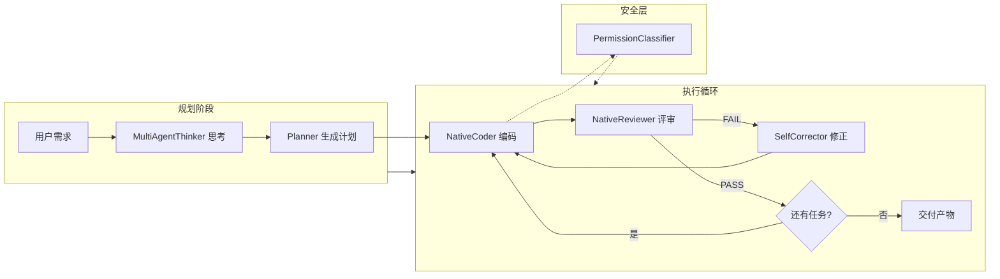

# appMaker

> AI 驱动的 APP 全自动开发系统 — 从「一句话需求」到「可交付代码」，零人工干预。

[](https://bun.sh)
[](https://developer.mozilla.org/en-US/docs/Web/JavaScript/Guide/Modules)
[](./LICENSE)

---

## 核心特性

| 特性 | 说明 |
|------|------|
| **全自动流程** | 需求 → 规划 → 编码 → 评审 → 修正，端到端自动化 |
| **Multi-Agent Thinking** | 4 角色并行思考（研究员/逻辑学家/创意人/总指挥），提升推理质量 |
| **智能工具系统** | 文件操作 / Bash 命令 / Git / 包管理器，Agent 可直接调用 |
| **安全权限分类** | 自动评估操作风险，低风险自动放行，高风险需确认 |
| **实时监控** | Web 仪表盘 + SSE 推送，进度一目了然 |
| **守护进程** | 持久化状态，支持断点恢复 |
| **沙箱测试** | `--mock` 模式模拟所有写操作，无需担心破坏环境 |

---

## 环境要求

| 依赖 | 版本 | 说明 |
|------|------|------|
| **Bun** | ≥ 1.0.0 | 运行时环境 |
| **API Key** | — | MiniMax / OpenAI / Deepseek 三选一 |
| **Python** | ≥ 3.8 | MCP 适配器需要（`uvx` 命令） |

### 安装 Bun

```bash
# Windows
powershell -c "irm bun.sh/install.ps1 | iex"

# macOS / Linux
curl -fsSL https://bun.sh/install | bash
```

---

## 快速开始

### 1. 安装

```bash
git clone <repo-url> && cd appmaker
bun install
cp .env.example .env
```

### 2. 配置 API Key

编辑 `.env`，选择其中一个 Provider：

```ini
# 方案 A: MiniMax（推荐，MCP 规划需要）
MINIMAX_API_KEY=your_key_here
MINIMAX_API_MODEL=MiniMax-Text-01
MINIMAX_API_HOST=https://api.minimaxi.com

# 方案 B: OpenAI
OPENAI_API_KEY=your_key_here
OPENAI_MODEL=gpt-4
OPENAI_API_BASE=https://api.openai.com/v1
```

### 3. 运行

```bash
# 推荐：一键全自动
bun cli.js run "做一个博客系统，支持文章发布和评论"

# 沙箱模式（仅模拟，不实际写文件）
bun cli.js run "做一个博客系统" --mock

# 跳过确认
bun cli.js run "做一个博客系统" --yes

# 指定工作目录
bun cli.js run "做一个博客系统" --dir ./my-project
```

---

## CLI 命令

| 命令 | 说明 |
|------|------|
| `bun cli.js run "<需求>"` | 全自动生成并执行（推荐） |
| `bun cli.js plan "<需求>"` | 仅生成计划文件 |
| `bun cli.js execute <plan.json>` | 执行已有计划 |
| `bun cli.js health` | 检查 Agent 可用性 |

| 全局选项 | 说明 |
|----------|------|
| `--dir <path>` | 指定工作目录 |
| `--no-daemon` | 禁用守护进程 |
| `--mock` | 沙箱模拟模式 |
| `--yes` / `-y` | 跳过确认 |
| `DEBUG=1` | 完整错误堆栈 |

---

## 工作流程



### 核心模块

| 模块 | 文件 | 职责 |
|------|------|------|
| **Planner** | `src/planner.js` | 需求分析、任务分解、MCP 集成 |
| **ExecutionEngine** | `src/engine.js` | 任务调度、评审循环、超时控制 |
| **NativeCoder** | `src/agents/native-coder.js` | 调用大模型生成代码 |
| **NativeReviewer** | `src/agents/native-reviewer.js` | 代码质量评审 |
| **Supervisor** | `src/supervisor.js` | 进度追踪、风险评估 |
| **SelfCorrector** | `src/corrector.js` | 根因分析、自动修复 |
| **MultiAgentThinker** | `src/thinker.js` | 4 角色并行思考 |
| **UniversalToolbox** | `src/agents/universal-toolbox.js` | 文件/Bash/Git/包管理工具 |
| **PermissionClassifier** | `src/agents/permission-classifier.js` | 操作风险评估 |
| **ProgressMonitor** | `src/monitor/index.js` | SSE 实时监控面板 |

---

## 工具系统

Agent 通过 UniversalToolbox 获得以下能力：

| 分类 | 工具 | 说明 |
|------|------|------|
| **文件系统** | `read_file`, `write_file`, `delete_file`, `list_dir` | 文件读写删查 |
| **Bash** | `bash_exec`, `npm_install`, `run_tests` | 命令执行 |
| **Git** | `git_status`, `git_commit`, `git_branch` | 版本控制 |
| **包管理** | `check_dependency`, `find_package` | 依赖分析 |
| **任务** | `todo_write`, `task_create`, `task_update` | 任务管理 |

### 权限安全

PermissionClassifier 自动评估操作风险：

| 风险等级 | 示例操作 | 处理方式 |
|----------|----------|----------|
| **低风险** | 读文件、查看目录 | 自动放行 |
| **中风险** | 写文件、执行测试 | 日志记录 |
| **高风险** | 删除系统文件、执行 `rm -rf` | 需人工确认 |

---

## JavaScript API

```javascript
import {
  createEngine,
  createPlanner,
  healthCheck,
  dispatch,
  dispatchParallel
} from './src/agents/index.js';

// 健康检查
const status = await healthCheck();
console.log(status);
// { 'native-coder': true, 'native-reviewer': true }

// 生成执行计划
const planner = createPlanner({ project_root: './my-app' });
const plan = await planner.plan('做一个博客系统');
console.log(plan.milestones);

// 执行计划
const engine = createEngine({
  project_root: './my-app',
  max_review_cycles: 3
});

engine.on('task:done', ({ task, result }) => {
  console.log(`Task ${task.id}:`, result.status);
});

await engine.execute(plan);

// 单任务调度
const result = await dispatch({
  type: 'create',
  description: '创建用户认证模块'
});

// 并行任务
const results = await dispatchParallel([
  { type: 'create', description: '创建文章模块' },
  { type: 'create', description: '创建评论模块' }
]);
```

---

## 进度监控

执行时自动启动 Web 仪表盘：

| 项目 | 说明 |
|------|------|
| **地址** | `http://localhost:8088`（端口冲突自动递增） |
| **协议** | Server-Sent Events (SSE) |
| **自动打开** | 非 Windows 自动调用浏览器 |

---

## 错误处理

| 错误类型 | 严重度 | 处理 |
|----------|--------|------|
| 安全漏洞 / 架构违规 | 🔴 严重 | 立即停止 |
| Token 超限 / 资源耗尽 | 🔴 严重 | 停止接受新任务 |
| 评审失败 | 🟡 一般 | SelfCorrector 自动修正（最多 3 轮） |
| 网络超时 | 🟡 一般 | 自动重试（最多 3 次） |

---

## 项目结构

```
appmaker/
├── cli.js                        # CLI 入口
├── daemon.js                     # 守护进程入口
├── src/
│   ├── engine.js                 # 执行引擎
│   ├── planner.js               # 规划器（MCP 集成）
│   ├── supervisor.js            # 监督者
│   ├── corrector.js             # 修正器
│   ├── thinker.js               # MultiAgentThinker
│   ├── logger.js                # 日志系统
│   │
│   ├── agents/
│   │   ├── index.js            # 统一导出
│   │   ├── base.js             # AgentAdapter 基类
│   │   ├── dispatcher.js       # 任务调度器
│   │   ├── native-coder.js     # 编程 Agent
│   │   ├── native-reviewer.js  # 评审 Agent
│   │   ├── minimax-mcp.js      # MiniMax MCP 适配器
│   │   ├── universal-toolbox.js # 工具箱
│   │   └── permission-classifier.js # 权限分类器
│   │
│   ├── daemon/
│   │   ├── index.js            # 主入口
│   │   ├── daemon-core.js      # 核心逻辑
│   │   ├── session-manager.js  # 会话管理
│   │   ├── task-queue.js       # 任务队列
│   │   └── memory-store.js     # 内存存储
│   │
│   └── monitor/
│       ├── index.js            # Bun.serve + SSE
│       └── public/index.html   # Web 仪表盘
│
├── config/
│   ├── index.js                 # 配置加载器
│   ├── schema.js               # Schema 验证
│   ├── defaults.json           # 默认配置
│   └── agents.json            # Agent 配置
│
├── rules/                      # AI 行为约束
├── skills/                     # 技能定义
└── tests/                      # 单元测试
```

---

## 技术栈

| 层级 | 技术 | 说明 |
|------|------|------|
| 运行时 | Bun 1.x | 冷启动 ~10x 提升 |
| 模块 | ES Modules | 现代化模块系统 |
| HTTP | `Bun.serve` / `fetch` | 零依赖 |
| MCP | `@modelcontextprotocol/sdk` | 模型上下文协议 |
| 规划 | MiniMax MCP (`uvx`) | 搜商增强规划 |
| 思考 | MultiAgentThinker | 4 角色并行推理 |
| 测试 | `bun test` | 零配置测试框架 |

---

## 更新日志

### v2.0.0 — 2026-03-31

| 变更 | 说明 |
|------|------|
| ⚡ 迁移至 Bun | 冷启动 ~10x 提升 |
| 📦 全量 ESM | 所有模块 `import/export` |
| 🔧 `Bun.spawn` 替代 `cross-spawn` | 根除 Windows `EINVAL` |
| 🌐 `fetch` 替代 `axios` | 零依赖 HTTP |
| 🧙 MultiAgentThinker | 4 角色并行思考提升推理质量 |
| 🔒 PermissionClassifier | 操作风险自动评估 |
| 🧹 UniversalToolbox | 统一工具接口 |
| 📝 --mock 模式 | 沙箱安全测试 |
| 🗑️ 移除冗余依赖 | dotenv、cross-spawn、jest、axios |

---

## 许可证

ISC © appMaker Contributors
