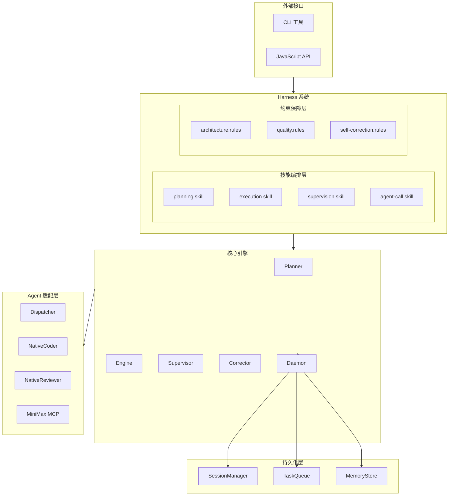
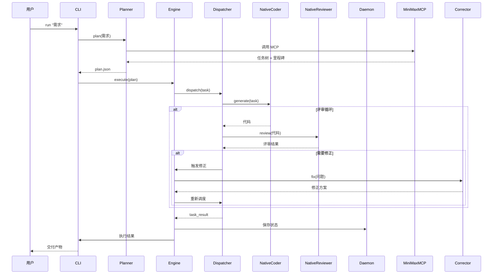
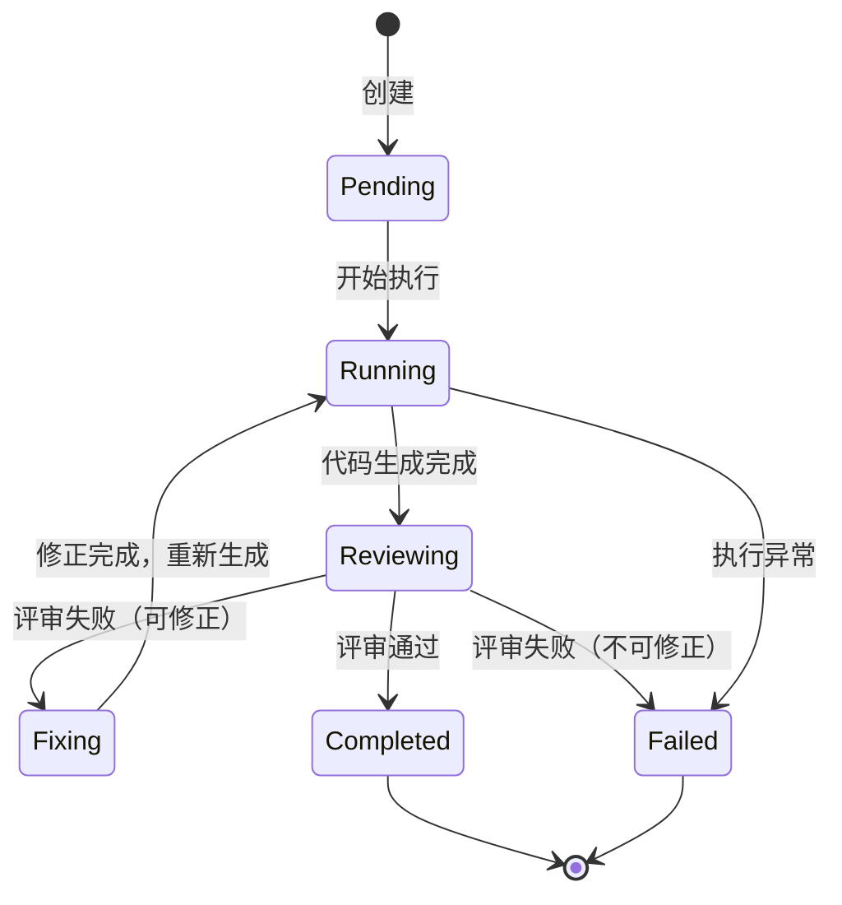

# NexusCodeForge (NCF) Harness 架构设计

NexusCodeForge 基于 **Harness Engineering** 理念构建，通过约束规则驱动 AI Agent 自主完成 APP 的策划、编写、优化、修正全流程。

---

## 设计理念

| 传统开发     | NexusCodeForge         |
| ------------ | ---------------------- |
| 人类编写代码 | AI 执行，Harness 编排  |
| Code Review  | 自动化质量检查 + Rules |
| 定期重构     | 自修正闭环持续优化     |
| 固定流程     | 可演化的规则系统       |

### 核心原则

1. **用约束换自主** — 规则越清晰，AI 能独立完成的越多
2. **共演化** — 随着模型能力提升，Harness 需持续调整
3. **自动化优先** — 能自动化的不依赖人工
4. **可追溯** — 所有决策有日志，所有变更可回滚

---

## 系统架构

### 整体架构图



### 数据流



---

## 模块职责

### 核心层（Core）

| 模块           | 职责                         | 关键方法                         |
| -------------- | ---------------------------- | -------------------------------- |
| **Planner**    | 需求解析 → 任务树 + 里程碑   | `plan()`, `parse()`              |
| **Engine**     | 执行循环、状态流转、事件分发 | `execute()`, `on()`              |
| **Supervisor** | 进度监控、风险评估、熔断     | `monitor()`, `assess()`          |
| **Corrector**  | 根因分析、修正方案生成       | `analyze()`, `fix()`             |
| **Daemon**     | 持久化、心跳、断点恢复       | `start()`, `save()`, `restore()` |

### Agent 适配层（Agents）

| 模块               | 职责                         | 通信方式         |
| ------------------ | ---------------------------- | ---------------- |
| **Dispatcher**     | 任务路由、并发控制、结果聚合 | 内部调用         |
| **NativeCoder**    | 调用大模型 API 生成代码      | HTTP (fetch)     |
| **NativeReviewer** | 调用大模型 API 评审代码      | HTTP (fetch)     |
| **MiniMaxMCP**     | MiniMax MCP 协议适配         | stdio (JSON-RPC) |

### 持久化层（Daemon）

| 模块               | 职责                 | 数据结构                |
| ------------------ | -------------------- | ----------------------- |
| **SessionManager** | 会话生命周期管理     | Map<sessionId, Session> |
| **TaskQueue**      | 任务队列、优先级调度 | PriorityQueue           |
| **MemoryStore**    | 状态快照、自动保存   | JSON 文件               |

### 编排层（Skills）

| 技能                  | 触发时机          | 输出                   |
| --------------------- | ----------------- | ---------------------- |
| **planning.skill**    | 用户提交需求时    | 任务树、里程碑、依赖图 |
| **execution.skill**   | Engine 执行任务时 | 任务状态变更           |
| **supervision.skill** | 每个任务完成后    | 风险评估报告           |
| **agent-call.skill**  | 需要外部 Agent 时 | Agent 调用结果         |

### 约束层（Rules）

| 规则                      | 检查时机   | 违规处理                |
| ------------------------- | ---------- | ----------------------- |
| **architecture.rules**    | 代码生成后 | 🔴 严重：停止并标记人工 |
| **quality.rules**         | 评审完成后 | ⚪ 普通：触发修正循环   |
| **self-correction.rules** | 评审失败时 | 根因分析 + 修正方案     |

---

## 执行流程

### 完整工作流

```
用户需求
    │
    ▼
┌──────────────┐
│   planning   │ ←── 技能：planning.skill
│   .skill     │
└──────────────┘
    │              输出：JSON 计划文件
    │              ├── tasks[]        任务列表
    │              ├── milestones[]   里程碑
    │              └── dependencies{} 依赖关系图
    ▼
┌──────────────┐
│   execution  │ ←── 技能：execution.skill
│   .skill     │
└──────────────┘
    │
    │ 循环执行每个任务
    ▼
┌──────────────┐
│   dispatch   │ ←── 路由到对应 Agent
│              │ ←── 并发控制（max_concurrent）
└──────────────┘
    │
    ├──► NativeCoder ──► 代码生成
    │
    ▼
┌──────────────┐
│   review     │ ←── NativeReviewer
│              │ ←── 质量评估
└──────────────┘
    │
    ├─ PASS ──────────────────┐
    │                         │
    ├─ FAIL (可修正) ──► 触发 self-correction.rules
    │                         │         │
    │                         │    最多 max_review_cycles 次
    │                         │
    └─────────────────────────┘
    │
    ▼
┌──────────────┐
│ supervision  │ ←── 技能：supervision.skill
│   .skill     │
└──────────────┘
    │
    │ 触发条件
    ├─ 风险阈值超限 ──► 🔴 停止，标记人工介入
    ├─ Token 超限   ──► 🔴 停止接受新任务
    └─ 进度异常     ──► 🟡 告警 + 日志
    │
    ▼
┌──────────────┐
│   daemon     │ ←── 持久化状态
│              │ ←── 自动保存
└──────────────┘
    │
    ▼
  交付产物
```

### 任务状态机



---

## 守护进程设计

### 架构

```
┌─────────────────────────────────────────────────┐
│                  Daemon Process                  │
├─────────────────────────────────────────────────┤
│                                                  │
│  ┌─────────────┐  ┌─────────────┐              │
│  │  Session    │  │   Task      │              │
│  │  Manager    │  │   Queue     │              │
│  └──────┬──────┘  └──────┬──────┘              │
│         │                │                      │
│         └───────┬────────┘                      │
│                 ▼                               │
│         ┌─────────────┐                        │
│         │   Memory    │                        │
│         │   Store     │                        │
│         └──────┬──────┘                        │
│                │                               │
│         ┌──────┴──────┐                        │
│         │  Auto Save  │  (60s interval)        │
│         └─────────────┘                        │
│                                                  │
│  ┌─────────────────────────────────────────┐   │
│  │            Heartbeat (30s)               │   │
│  └─────────────────────────────────────────┘   │
│                                                  │
└─────────────────────────────────────────────────┘
           │
           │ 状态快照 (.daemon/state.json)
           ▼
    ┌─────────────┐
    │  Workspace  │
    │  (.daemon/) │
    └─────────────┘
```

### 故障恢复

1. **进程异常退出** → 重启后读取 `.daemon/state.json`
2. **任务执行中断** → 从上一次保存的状态恢复
3. **心跳超时** → 标记会话为 `unhealthy`，等待恢复

---

## 扩展指南

### 添加新 Agent

1. **创建适配器**：`src/agents/<name>.js`

   ```javascript
   import { AgentAdapter } from './base.js';

   export class MyAgentAdapter extends AgentAdapter {
     async execute(task) {
       // 实现任务执行逻辑
       return { success: true, output: '...' };
     }
   }
   ```

2. **注册到 Dispatcher**：

   ```javascript
   // src/agents/index.js
   import { MyAgentAdapter } from './<name>.js';

   dispatcher.registerAgent('my-agent', new MyAgentAdapter(config));
   ```

3. **配置路由规则**：
   ```json
   // config/agents.json
   {
     "agents": {
       "my-agent": { "enabled": true }
     }
   }
   ```

### 添加新 Rule

1. **创建规则文件**：`rules/<name>.rules.md`
2. **定义触发条件**：

   ```markdown
   ## 触发条件

   当 [某事件] 发生时，且 [某条件] 满足时触发

   ## 处理流程

   1. ...
   2. ...
   ```

3. **在对应 Skill 中引用**

### 添加新 Skill

1. **创建技能文件**：`skills/<name>.skill.md`
2. **定义输入/输出**：

   ```markdown
   ## 输入

   - 参数1: 类型，说明

   ## 输出

   - 返回值: 类型，说明

   ## 执行流程

   1. ...
   2. ...
   ```

3. **在 Engine 中集成**

---

## 关键技术选型

| 场景        | 选型             | 理由                                  |
| ----------- | ---------------- | ------------------------------------- |
| 运行时      | Bun 1.x          | 冷启动快、ESM 原生支持、HTTP 服务内置 |
| 模块系统    | ES Modules       | 现代标准，无须转译                    |
| Web 服务    | `Bun.serve`      | 零依赖、性能优异                      |
| HTTP 客户端 | 原生 `fetch`     | 标准 API、内置 `AbortSignal`          |
| 进程通信    | stdio + JSON-RPC | MCP 协议标准                          |
| 测试框架    | `bun test`       | 零配置、内置覆盖率                    |
| 配置管理    | JSON + 环境变量  | 简单可靠                              |

---

## 性能考量

| 指标         | 目标值  | 优化手段             |
| ------------ | ------- | -------------------- |
| 冷启动       | < 200ms | Bun 预编译、懒加载   |
| 任务调度延迟 | < 50ms  | 内存队列、无锁设计   |
| 状态保存     | < 100ms | 增量保存、后台写入   |
| 并发任务     | 3 个    | 可配置、避免资源竞争 |

---

## 安全性设计

| 风险     | 防护措施                     |
| -------- | ---------------------------- |
| 指令注入 | 输入校验、路径限制           |
| 资源耗尽 | Token 阈值、任务超时         |
| 数据泄露 | 工作目录隔离、禁止主目录操作 |
| 权限提升 | 最小权限原则、禁用危险操作   |

---

## 参考文档

| 文档                                           | 说明              |
| ---------------------------------------------- | ----------------- |
| [AGENTS.md](./AGENTS.md)                       | AI Agent 工作手册 |
| [skills/\*](./skills/)                         | 各技能详细定义    |
| [rules/\*](./rules/)                           | 约束规则详细说明  |
| [src/agents/README.md](./src/agents/README.md) | Agent 适配层实现  |
| [src/daemon/README.md](./src/daemon/README.md) | 守护进程实现      |
