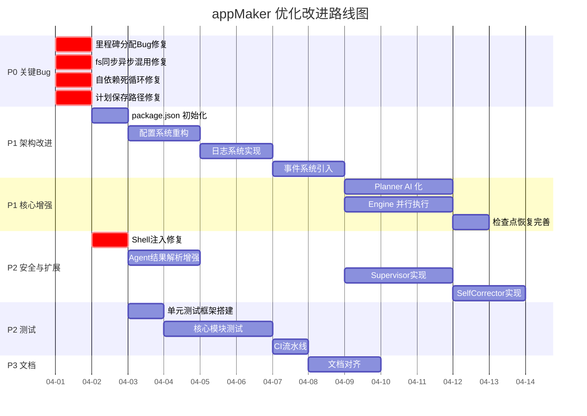

# appMaker 优化改进计划

基于对项目全部代码、文档、Skills 和 Rules 的深度审查，制定以下改进方案。

## 项目现状总览

| 维度 | 评分 | 说明 |
|------|------|------|
| 架构设计 | ⭐⭐⭐⭐ | 分层清晰，Skill/Rule 文档完善 |
| 代码质量 | ⭐⭐☆☆ | 存在多处 Bug 和不健壮的实现 |
| 功能完整度 | ⭐⭐☆☆ | 核心流程可跑通，但监控/日志/测试未实现 |
| 错误处理 | ⭐⭐☆☆ | 大量空 catch, 静默吞错 |
| 可扩展性 | ⭐⭐⭐☆ | Agent 适配器模式好，但缺乏插件机制 |
| 文档一致性 | ⭐⭐⭐☆ | 文档与代码有脱节之处 |

---

## 一、🔴 关键 Bug 修复（P0 — 立即修复）

### 1.1 Planner 里程碑分配逻辑错误

**文件**: [planner.js](file:///d:/workflow/appmaker/src/planner.js#L186-L193)

```javascript
// ❌ 当前代码：task.phase 根本不存在于 task 对象中！
} else if (task.phase === 'integrate') {  // BUG: 应查 task.type
    milestones[2].tasks.push(task.id);
} else if (task.type === 'test' || task.type === 'create' && task.description.includes('部署')) {
    // BUG: 运算符优先级问题。&& 优先于 ||
    // 实际语义: task.type === 'test' || (task.type === 'create' && ...)
    milestones[3].tasks.push(task.id);
}
```

**问题**:
1. `task.phase` 永远不等于 `'integrate'`，因为任务对象中只有 `task.type === 'integrate'`
2. `||` 和 `&&` 的运算符优先级导致 `type === 'test'` 的任务被错误分类到"上线准备"阶段，而非"集成测试"阶段
3. "集成测试"里程碑永远为空，会被 `filter(m => m.tasks.length > 0)` 清理掉

**修复方案**:
```javascript
} else if (task.type === 'integrate') {
    milestones[2].tasks.push(task.id);
} else if (task.type === 'test' || (task.type === 'create' && task.description.includes('部署'))) {
    milestones[3].tasks.push(task.id);
}
```

---

### 1.2 Engine 加载规则的同步/异步混用

**文件**: [engine.js](file:///d:/workflow/appmaker/src/engine.js#L254-L264)

```javascript
// ❌ 当前代码：engine.js 顶部 import 的是 promises 版本的 fs
const fs = require('fs').promises;

// 但 _loadRule 方法使用了同步方法
_loadRule(ruleName) {
    const rulePath = path.join(__dirname, '..', 'rules', `${ruleName}.rules.md`);
    if (fs.existsSync(rulePath)) {        // BUG: promises 版本没有 existsSync
        return fs.readFileSync(rulePath);  // BUG: promises 版本没有 readFileSync
    }
}
```

`fs.promises` 上不存在 `existsSync` 和 `readFileSync`，该方法会直接抛出 `TypeError`，导致每次执行时规则加载全部失败，上下文中 `architecture_rules` 和 `quality_rules` 永远为空字符串。

**修复方案**:
```javascript
// 方案 A: 改为异步方法
async _loadRule(ruleName) {
    const rulePath = path.join(__dirname, '..', 'rules', `${ruleName}.rules.md`);
    try {
        return await fs.readFile(rulePath, 'utf-8');
    } catch {
        return '';
    }
}

// 同时 _buildContext 也要改为 async
async _buildContext(task, plan) { ... }
```

---

### 1.3 计划文件中的自依赖死循环

**文件**: [plan_1774939768808.json](file:///d:/workflow/appmaker/plans/plan_1774939768808.json#L74-L76)

```json
{
    "id": "t4",
    "description": "功能集成和联调测试",
    "dependencies": ["t4"]  // ❌ 自依赖！永远 blocked
}
```

**根因**: [planner.js](file:///d:/workflow/appmaker/src/planner.js#L135-L143) 中的任务依赖计算有 off-by-one 错误：

```javascript
// 集成任务的依赖计算
dependencies: features.map((_, i) => `t${taskId - features.length + i}`)
// 当 features.length === 1 时，taskId 已经被 ++ 指向了下一个任务
// 产生的依赖恰好指向自身
```

**修复方案**: 在生成依赖之前先记录当前 taskId，或者使用已生成的 feature task id 列表。

---

### 1.4 Planner 计划保存路径错误

**文件**: [cli.js](file:///d:/workflow/appmaker/cli.js#L120-L125)

```javascript
const planner = new Planner({ project_root: executeDir });
const plan = await planner.plan(requirement);
const filename = `plan_${Date.now()}.json`;
const { filepath } = await planner.savePlan(plan, filename);
```

`savePlan` 使用 `this.projectRoot` 作为默认保存路径，即 `executeDir`（用户工作目录），而不是 `plans/` 目录。计划文件被写入到了错误的位置。

**修复方案**: 在 `savePlan` 调用时显式传入 `plans/` 目录路径：
```javascript
const plansDir = path.join(__dirname, 'plans');
await planner.savePlan(plan, filename, plansDir);
```

---

## 二、🟠 架构改进（P1 — 1 周内完成）

### 2.1 引入 `package.json` 和依赖管理

> [!IMPORTANT]
> 项目当前没有 `package.json`！无法通过 `npm install` 安装，也无法通过 `npx` 使用。

**改进点**:
- 创建 `package.json`，定义 `bin` 入口
- 添加 `"type": "module"` 或保持 CommonJS，但要明确
- 添加开发依赖：`jest` (测试), `eslint` (代码检查)
- 定义 `scripts`：`test`, `lint`, `start`

---

### 2.2 配置系统重构

**当前问题**:
- `config/agents.json` 中的配置与代码中的默认值不一致（如 `cli_path: "claude"` vs `cli_path: "claude-code"`）
- [config/index.js](file:///d:/workflow/appmaker/config/index.js) 虽然加载了配置，但几乎无处引用
- [agents/index.js](file:///d:/workflow/appmaker/src/agents/index.js#L17-L21) 自行重复加载配置
- 硬编码散布各处，违反自身 `architecture.rules.md` 中的"禁止硬编码"规则

**改进方案**:

```
config/
├── index.js          # 统一配置加载器（带 Schema 验证）
├── agents.json       # Agent 配置
├── defaults.json     # 默认值（当前散布在代码中的硬编码）
└── schema.js         # JSON Schema 验证
```

---

### 2.3 日志系统落地

**当前问题**: `supervision.skill.md` 定义了详细的日志规范（按任务、质量、修正分类），但代码中只有 `console.log`，没有任何日志持久化。

**改进方案**:

```javascript
// src/logger.js
class Logger {
    constructor(options = {}) {
        this.logDir = options.logDir || '.appmaker/logs';
        this.level = options.level || 'info';
    }

    info(category, message, meta = {}) { ... }
    warn(category, message, meta = {}) { ... }
    error(category, message, meta = {}) { ... }

    // 按 supervision.skill.md 定义的结构输出
    // logs/execution/task_t1.log
    // logs/quality/lint_001.log
    // logs/supervisor.log
    // logs/corrections/corr_001.md
}
```

---

### 2.4 事件系统 — 解耦 Engine 和 Supervision

[engine.js](file:///d:/workflow/appmaker/src/engine.js) 中进度报告、检查点、日志三者耦合在一起。`supervision.skill.md` 定义的 Dashboard 概念在代码中完全缺失。

**改进方案**: 引入 EventEmitter，让 Engine 广播事件，Supervisor 订阅处理：

```javascript
// engine.js
const { EventEmitter } = require('events');

class ExecutionEngine extends EventEmitter {
    async _executeTask(task, plan) {
        this.emit('task:start', { task });
        // ...执行...
        this.emit('task:done', { task, result });
        this.emit('progress', { done, total });
    }
}

// src/supervisor.js (新增)
class Supervisor {
    constructor(engine) {
        engine.on('task:done', (data) => this._checkQuality(data));
        engine.on('progress', (data) => this._updateDashboard(data));
    }
}
```

---

## 三、🟡 Planner 智能化升级（P1）

### 3.1 当前问题

Planner 完全基于关键词匹配 + 硬编码模板，缺乏真正的"理解需求"能力：

| 设计文档要求 | 代码实际实现 |
|------------|------------|
| "提取关键实体" | 正则切词 + `toLowerCase().includes()` |
| "识别核心/次要目标" | 未实现 |
| "澄清模糊点" | 未实现 |
| "任务树（树形结构）" | 平铺列表 + 固定 4 阶段 |
| "Agent 选择"（claude-code or opencode）| 全部硬编码为 `claude-code` |
| "资源预估" | 固定数字（2000/3000/2500 tokens） |

### 3.2 改进方案

#### 阶段 1：利用 claude-code 做需求分析

```javascript
async plan(requirement) {
    // 1. 调用 claude-code 做深度需求分析
    const analysis = await this.dispatcher.dispatch({
        type: 'analysis',
        description: `分析以下需求，输出 JSON 格式的任务分解：\n${requirement}`,
        context: {
            output_format: PLAN_SCHEMA  // 提供期望的输出 Schema
        }
    });

    // 2. 验证和修正 AI 产出的计划
    return this._validatePlan(analysis);
}
```

#### 阶段 2：增加已有项目分析

当 `project_root` 指向已有项目时，先扫描目录结构、`package.json`、README 等，为 AI 提供上下文。

#### 阶段 3：交互式需求澄清

当需求模糊时，生成澄清问题列表返回给用户确认后再生成计划。

---

## 四、🟡 Engine 鲁棒性增强（P1）

### 4.1 并行执行未实现

`execution.skill.md` 文档描述了并行执行策略，但 [engine.js](file:///d:/workflow/appmaker/src/engine.js#L42-L69) 中所有任务都是**串行**执行的 (`for...of` 循环)。

**改进方案**:

```javascript
async _executeMilestone(milestone, plan) {
    const tasks = milestone.tasks.map(id => plan.tasks.find(t => t.id === id));
    
    // 按依赖层级分组
    const layers = this._topologicalSort(tasks);
    
    for (const layer of layers) {
        // 同层无依赖的任务并行执行
        await Promise.allSettled(
            layer.map(task => this._executeTask(task, plan))
        );
    }
}
```

### 4.2 检查点恢复不完整

[engine.js](file:///d:/workflow/appmaker/src/engine.js#L398-L413) 的 `restore` 方法恢复了 `tasks` Map，但没有实现"从检查点继续执行"的逻辑——恢复后不知道从哪个任务继续。

**改进方案**: 恢复后过滤已完成任务，从 `pending`/`blocked` 状态的任务继续。

### 4.3 增加任务超时机制

Engine 层缺少任务级超时。只有 Agent 层有 CLI 级超时，但如果 Agent 返回后处理逻辑卡住则无法兜底。

### 4.4 Token 预算跟踪

`supervision.skill.md` 中定义了 Token 消耗监控，代码中完全缺失。需要在 Engine 中累计每个 Agent 调用的 token 消耗，并在超过阈值时触发告警。

---

## 五、🟡 Agent 适配器改进（P2 — 2 周内）

### 5.1 OpenCode CLI 调用的 Shell 注入风险

**文件**: [opencode.js](file:///d:/workflow/appmaker/src/agents/opencode.js#L128)

```javascript
// ❌ 危险：直接字符串拼接构建 shell 命令
let cmd = `${this.cliPath} "${prompt.replace(/"/g, '\\"')}"`;
```

简单的引号转义无法防止所有注入场景（如 `$()` 或反引号命令替换）。

> [!CAUTION]
> 这是一个**安全漏洞**。如果 prompt 中包含恶意内容（如来自用户需求描述），可以执行任意 Shell 命令。

**修复方案**: 改用 `spawn` + 数组参数（与 `claude-code.js` 保持一致），避免 shell 注入：

```javascript
async _reviewViaCLI(prompt, context) {
    const { spawn } = require('child_process');
    const args = [prompt];  // 不经过 shell 解析
    // ...
}
```

### 5.2 OpenCode 和 Claude-Code 健康检查不一致

- `claude-code.js` 的 `healthCheck` 支持 CLI 和 API 两种模式
- `opencode.js` 的 `healthCheck` 只支持 CLI 模式，且没有超时处理

### 5.3 Agent 结果解析脆弱

[claude-code.js](file:///d:/workflow/appmaker/src/agents/claude-code.js#L121-L141) 尝试从输出中提取 JSON，但逻辑过于简单（逐行 `JSON.parse`），无法处理多行 JSON 或 JSON 嵌套在 Markdown 代码块中的情况。

**改进方案**: 增加更健壮的 JSON 提取逻辑：

```javascript
_extractJSON(output) {
    // 1. 尝试直接解析
    // 2. 尝试从 ```json ... ``` 代码块中提取
    // 3. 尝试从最后一个 { 到最后一个 } 的子串
    // 4. 降级为文本结果
}
```

### 5.4 新增 Agent 热插拔机制

当前 Dispatcher 在初始化时硬编码了所有 Agent。扩展指南中说"实现适配器 `agents/<name>.adapter.js`"，但没有动态注册机制。

**改进方案**:

```javascript
class AgentDispatcher {
    registerAgent(name, adapter) {
        this.agents.set(name, adapter);
    }
    
    unregisterAgent(name) {
        this.agents.delete(name);
    }
}
```

---

## 六、🔵 Supervision 系统实现（P2）

### 6.1 当前空白

`supervision.skill.md` 定义了完善的监控体系，但代码中**完全没有 Supervisor 类实现**。仅有 `_reportProgress` 和 `_createCheckpoint` 两个简单方法挂在 Engine 上。

### 6.2 实现计划

#### 新增文件: `src/supervisor.js`

```javascript
class Supervisor {
    constructor(engine, config = {}) {
        this.engine = engine;
        this.metrics = { tasks: {}, tokens: 0, errors: [] };
        this.thresholds = config.thresholds || DEFAULT_THRESHOLDS;
        
        // 订阅 Engine 事件
        engine.on('task:start', (d) => this._onTaskStart(d));
        engine.on('task:done', (d) => this._onTaskDone(d));
        engine.on('task:error', (d) => this._onTaskError(d));
        engine.on('milestone:done', (d) => this._onMilestoneDone(d));
    }

    // 定期生成 supervision.skill.md 中定义的状态报告
    generateReport() { ... }
    
    // 风险评估 (🟢🟡🔴⛔)
    assessRisk() { ... }
    
    // 触发 self-correction
    triggerCorrection(type, context) { ... }
}
```

#### 新增文件: `src/corrector.js`

实现 `self-correction.rules.md` 中定义的修正流程：

```javascript
class SelfCorrector {
    async correct(trigger) {
        // 1. 分析根因
        const rootCause = this._analyzeRootCause(trigger);
        // 2. 选择修正类型
        const strategy = this._selectStrategy(rootCause);
        // 3. 执行修正
        const result = await this._executeCorrection(strategy);
        // 4. 验证效果
        const verified = await this._verify(result);
        // 5. 记录经验
        this._logCorrection(trigger, rootCause, result, verified);
        return verified;
    }
}
```

---

## 七、🔵 测试与 DevOps（P2）

### 7.1 测试现状

项目当前 **零测试覆盖**。这与 `quality.rules.md` 中要求的"核心业务逻辑 ≥ 80%"严重不符。

### 7.2 测试计划

| 模块 | 测试类型 | 优先级 | 要点 |
|------|---------|--------|------|
| `planner.js` | 单元测试 | P0 | 需求分析、任务分解、里程碑分配、依赖计算 |
| `engine.js` | 单元测试 + 集成测试 | P0 | 任务执行循环、修正循环、检查点 |
| `dispatcher.js` | 单元测试 | P1 | Agent 选择逻辑、并发控制 |
| `claude-code.js` | 单元测试 (mock CLI) | P1 | prompt 构建、结果解析、重试 |
| `opencode.js` | 单元测试 (mock CLI) | P1 | 评审 prompt、结果格式化 |
| `cli.js` | 集成测试 | P2 | 端到端流程 |

### 7.3 CI 流水线

```yaml
# .github/workflows/ci.yml
name: CI
on: [push, pull_request]
jobs:
  test:
    steps:
      - run: npm ci
      - run: npm run lint
      - run: npm test -- --coverage
      - name: Check coverage
        run: npx jest --coverageThreshold='{"global":{"lines":80}}'
```

---

## 八、📋 文档与规范对齐（P3）

### 8.1 文档 vs 代码不一致

| 文档描述 | 代码实际 | 差异 |
|---------|---------|------|
| `harness.md` 中的目录写 `.claude/` | 实际无 `.claude/` 目录 | 文档过时 |
| `README.md` 中 `createEngine` 和 `createPlanner` 来自 `'./src/agents'` | 正确 | ✓ |
| `harness.md` 使用 `claude-code --skill` 命令 | CLI 实际是 `node cli.js` | 文档过时 |
| `agents/README.md` 引用 `config.json` | 实际是 `config/agents.json` | 路径不一致 |
| `AGENTS.md` 提到 `/task` 和 `/checkpoint` 命令 | CLI 未实现这些命令 | 功能缺失 |

### 8.2 改进方案

1. 统一所有文档中的命令和路径引用
2. 在 `harness.md` 中标注版本号和最后更新时间
3. 添加自动化文档检查（验证文档中引用的文件路径是否存在）

---

## 执行优先级总览



---

## 开放问题

> [!IMPORTANT]
> 以下问题需要确认后才能推进具体实现：

1. **Agent 通信模式**：当前仅支持 CLI 和 HTTP API。是否需要也支持 WebSocket 用于实时日志流？
2. **Planner AI 化**：是否直接使用 claude-code 做需求分析，还是用更轻量的 API 调用？这关系到成本。
3. **持久化方案**：当前用 JSON 文件存储计划和检查点。随着规模增大是否需要引入 SQLite？
4. **多项目支持**：当前 Engine 一次只能执行一个计划。是否需要支持同时管理多个项目？
5. **OpenCode 是否可替换**：opencode 的 CLI 可用性不稳定，是否考虑备选评审 Agent（如使用不同 LLM API）？
